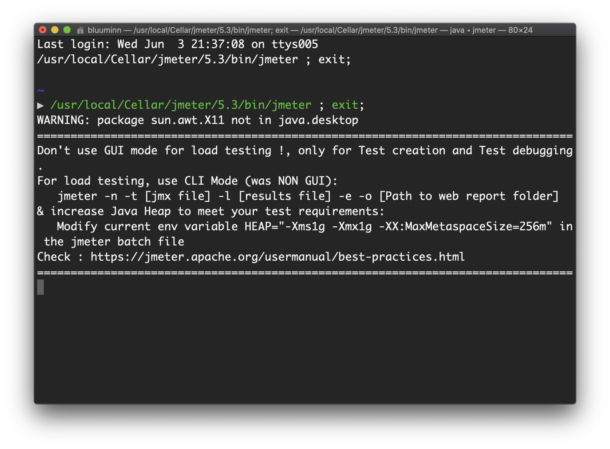
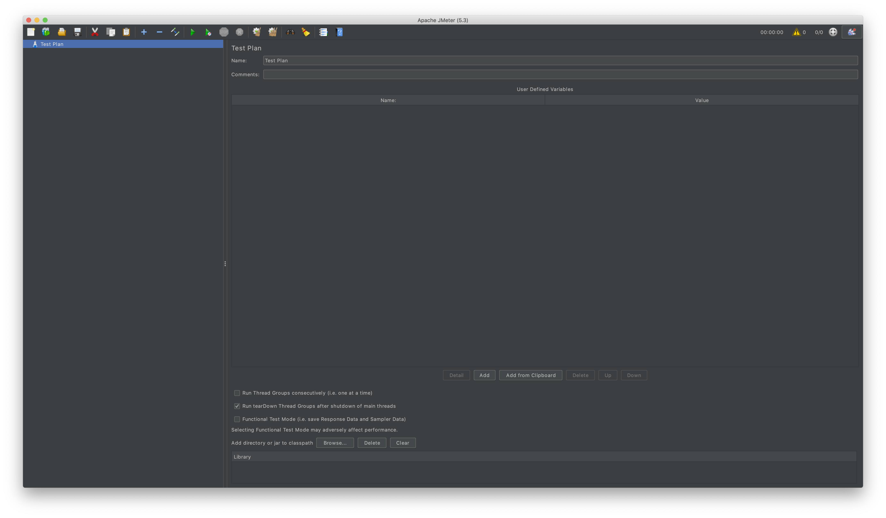

# Jmeter


## 설치

```zsh
$ brew install jmeter
Error: The following directories are not writable by your user:
/usr/local/share/zsh
/usr/local/share/zsh/site-functions

You should change the ownership of these directories to your user.
  # 아래 한줄 그대로 복사해서 붙여넣기
  sudo chown -R $(whoami) /usr/local/share/zsh /usr/local/share/zsh/site-functions

And make sure that your user has write permission.
  # 여기도 그대로 복사해서 붙여넣기
  chmod u+w /usr/local/share/zsh /usr/local/share/zsh/site-functions
  
# 그리고 다시 설치하면 잘 설치 된다.
$ brew install jmeter
```


## 실행

```zsh
$ open /usr/local/bin/jmeter
```




실행하면 위와 같은 터미널이 뜬 뒤,




위와 같은 프로그램이 실행된다.

