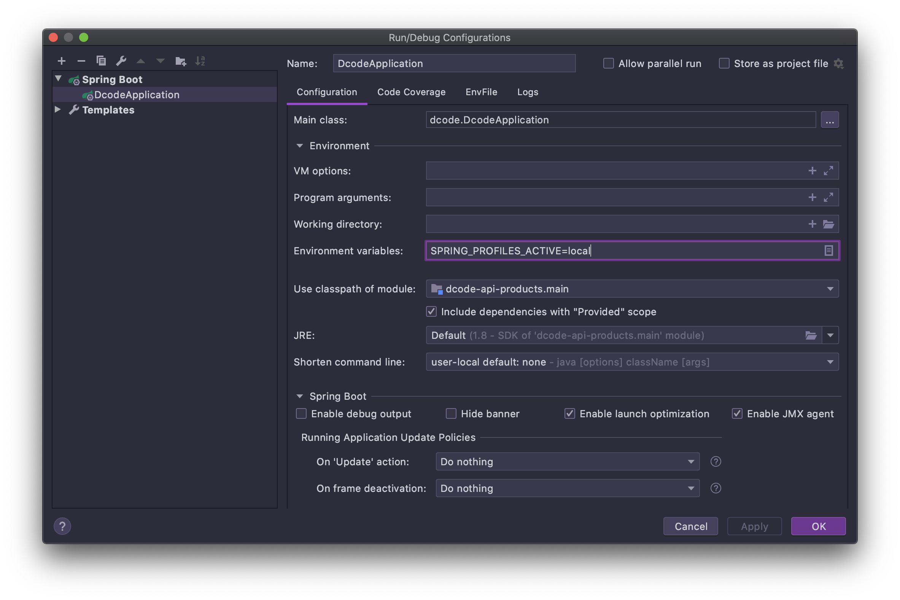

# Error Wiki (에러 모음집)


## 2020-06-04

### 배경

- products 프로젝트 빌드 진행.. 아래와 같은 에러 발생

```java
Description:

Failed to configure a DataSource: 'url' attribute is not specified and no embedded datasource could be configured.

Reason: Failed to determine a suitable driver class
```

보통은 `application.yml`이나 `application.properties`에 JDBC 설정을 해주면 된다고 함.

하지만 해당 프로젝트 안에는 `application.yml`이 없었다. spring cloud 에서 받아오기 때문에... 설정 파일에는 문제가 없었는데

실행 환경 설정을 따로 해주지 않았다..


### 해결



Environment variables 부분에 Profiles 설정을 해줬더니 잘 됐다~~ 끝.

---