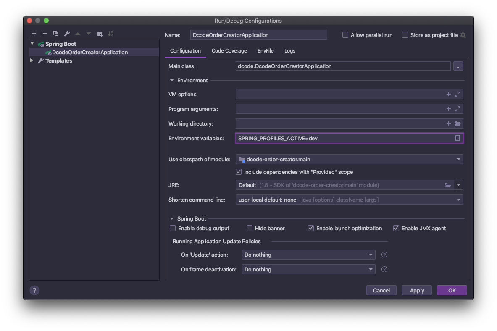
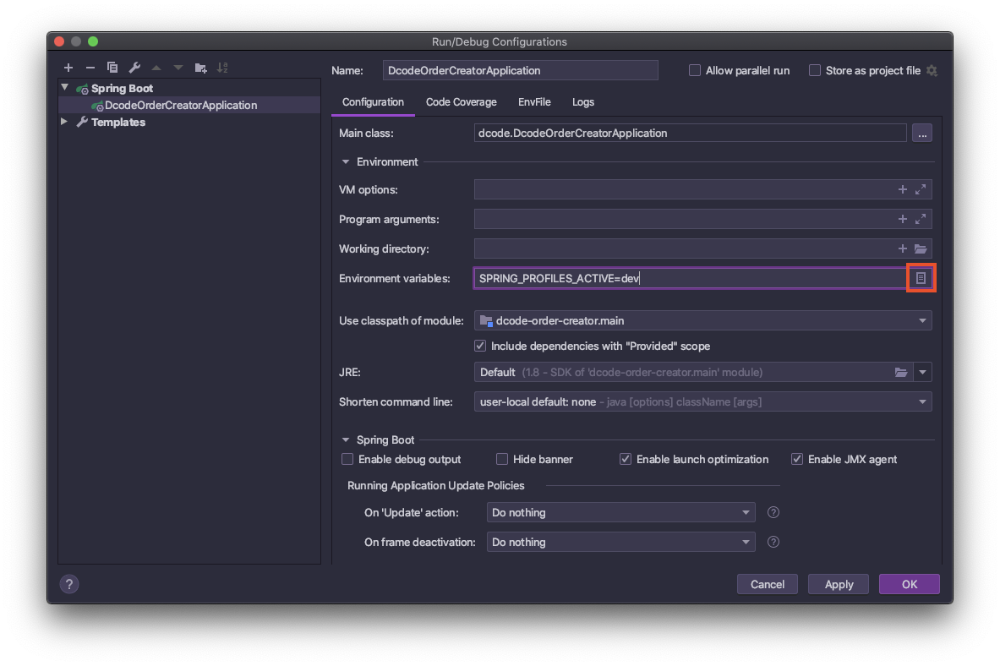
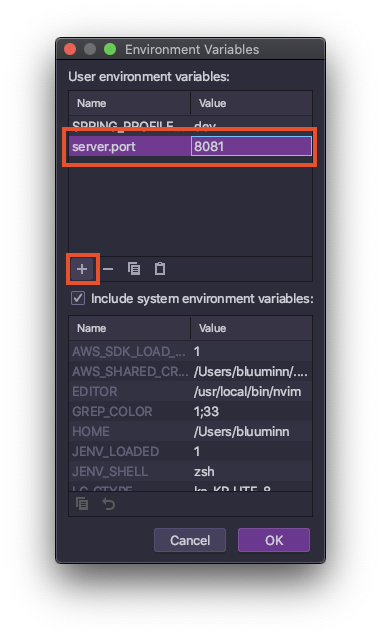

# Error Wiki (에러 모음집)


## 2020-06-04

### 배경

- products 프로젝트 빌드 진행.. 아래와 같은 에러 발생

```
  .   ____          _            __ _ _
 /\\ / ___'_ __ _ _(_)_ __  __ _ \ \ \ \
( ( )\___ | '_ | '_| | '_ \/ _` | \ \ \ \
 \\/  ___)| |_)| | | | | || (_| |  ) ) ) )
  '  |____| .__|_| |_|_| |_\__, | / / / /
 =========|_|==============|___/=/_/_/_/
 :: Spring Boot ::        (v2.0.4.RELEASE)

17:12:50:050|-INFO  ConfigServicePropertySourceLocator - Fetching config from server at : https://config.letsdcode.com
17:12:50:050|-INFO  ConfigServicePropertySourceLocator - Located environment: name=dcode-api, profiles=[default], label=null, version=0532200004e0f5bdd759993fe80f58574e05f1e7, state=null
17:12:50:050|-INFO  PropertySourceBootstrapConfiguration - Located property source: CompositePropertySource {name='configService', propertySources=[MapPropertySource {name='configClient'}, MapPropertySource {name='git@bitbucket.org:ncodeofficial/spring-cloud-config.git/dcode-api.yml (document #0)'}]}
17:12:50:050|-INFO  DcodeApplication - No active profile set, falling back to default profiles: default
17:12:50:050|-INFO  AnnotationConfigServletWebServerApplicationContext - Refreshing org.springframework.boot.web.servlet.context.AnnotationConfigServletWebServerApplicationContext@e57b96d: startup date [Fri Jun 05 17:12:50 KST 2020]; parent: org.springframework.context.annotation.AnnotationConfigApplicationContext@c03cf28
17:12:54:054|-INFO  DefaultListableBeanFactory - Overriding bean definition for bean 'handlerExceptionResolver' with a different definition: replacing [Root bean: class [null]; scope=; abstract=false; lazyInit=false; autowireMode=3; dependencyCheck=0; autowireCandidate=true; primary=false; factoryBeanName=delegatingWebMvcConfiguration; factoryMethodName=handlerExceptionResolver; initMethodName=null; destroyMethodName=(inferred); defined in class path resource [org/springframework/web/servlet/config/annotation/DelegatingWebMvcConfiguration.class]] with [Root bean: class [null]; scope=; abstract=false; lazyInit=false; autowireMode=3; dependencyCheck=0; autowireCandidate=true; primary=false; factoryBeanName=awsLambdaConfig; factoryMethodName=handlerExceptionResolver; initMethodName=null; destroyMethodName=(inferred); defined in class path resource [dcode/config/AwsLambdaConfig.class]]
17:12:54:054|-INFO  RepositoryConfigurationDelegate - Multiple Spring Data modules found, entering strict repository configuration mode!
17:12:54:054|-INFO  RepositoryConfigurationDelegate - Multiple Spring Data modules found, entering strict repository configuration mode!
17:12:54:054|-INFO  RepositoryConfigurationExtensionSupport - Spring Data Redis - Could not safely identify store assignment for repository candidate interface dcode.domain.repository.BrandRepository.
17:12:54:054|-INFO  RepositoryConfigurationExtensionSupport - Spring Data Redis - Could not safely identify store assignment for repository candidate interface dcode.domain.repository.CartRepository.
17:12:54:054|-INFO  RepositoryConfigurationExtensionSupport - Spring Data Redis - Could not safely identify store assignment for repository candidate interface dcode.domain.repository.CategoryRepository.
17:12:54:054|-INFO  RepositoryConfigurationExtensionSupport - Spring Data Redis - Could not safely identify store assignment for repository candidate interface dcode.domain.repository.CoverCollectionProductConditionRepository.
17:12:54:054|-INFO  RepositoryConfigurationExtensionSupport - Spring Data Redis - Could not safely identify store assignment for repository candidate interface dcode.domain.repository.CoverCollectionRepository.
17:12:54:054|-INFO  RepositoryConfigurationExtensionSupport - Spring Data Redis - Could not safely identify store assignment for repository candidate interface dcode.domain.repository.OrderListRepository.
17:12:54:054|-INFO  RepositoryConfigurationExtensionSupport - Spring Data Redis - Could not safely identify store assignment for repository candidate interface dcode.domain.repository.OrderRepository.
17:12:54:054|-INFO  RepositoryConfigurationExtensionSupport - Spring Data Redis - Could not safely identify store assignment for repository candidate interface dcode.domain.repository.ProductPreOrderTermsRepository.
17:12:54:054|-INFO  RepositoryConfigurationExtensionSupport - Spring Data Redis - Could not safely identify store assignment for repository candidate interface dcode.domain.repository.ProductRepository.
17:12:54:054|-INFO  RepositoryConfigurationExtensionSupport - Spring Data Redis - Could not safely identify store assignment for repository candidate interface dcode.domain.repository.ProductReviewCommentsRepository.
17:12:54:054|-INFO  RepositoryConfigurationExtensionSupport - Spring Data Redis - Could not safely identify store assignment for repository candidate interface dcode.domain.repository.ProductReviewRepository.
17:12:54:054|-INFO  RepositoryConfigurationExtensionSupport - Spring Data Redis - Could not safely identify store assignment for repository candidate interface dcode.domain.repository.ProductSoldStockRepository.
17:12:54:054|-INFO  RepositoryConfigurationExtensionSupport - Spring Data Redis - Could not safely identify store assignment for repository candidate interface dcode.domain.repository.ProductStockRepository.
17:12:54:054|-INFO  RepositoryConfigurationExtensionSupport - Spring Data Redis - Could not safely identify store assignment for repository candidate interface dcode.domain.repository.UserBrandLikeRepository.
17:12:54:054|-INFO  RepositoryConfigurationExtensionSupport - Spring Data Redis - Could not safely identify store assignment for repository candidate interface dcode.domain.repository.UserCategory1LikeRepository.
17:12:54:054|-INFO  RepositoryConfigurationExtensionSupport - Spring Data Redis - Could not safely identify store assignment for repository candidate interface dcode.domain.repository.UserCategory2LikeRepository.
17:12:54:054|-INFO  RepositoryConfigurationExtensionSupport - Spring Data Redis - Could not safely identify store assignment for repository candidate interface dcode.domain.repository.UserCategory3LikeRepository.
17:12:54:054|-INFO  RepositoryConfigurationExtensionSupport - Spring Data Redis - Could not safely identify store assignment for repository candidate interface dcode.domain.repository.UserProductFilterLogRepository.
17:12:54:054|-INFO  RepositoryConfigurationExtensionSupport - Spring Data Redis - Could not safely identify store assignment for repository candidate interface dcode.domain.repository.UserProductLikeRepository.
17:12:54:054|-INFO  RepositoryConfigurationExtensionSupport - Spring Data Redis - Could not safely identify store assignment for repository candidate interface dcode.domain.repository.UserProductReviewsRepository.
17:12:54:054|-INFO  RepositoryConfigurationExtensionSupport - Spring Data Redis - Could not safely identify store assignment for repository candidate interface dcode.domain.repository.UserProductViewRepository.
17:12:54:054|-INFO  RepositoryConfigurationExtensionSupport - Spring Data Redis - Could not safely identify store assignment for repository candidate interface dcode.domain.repository.UserRepository.
17:12:54:054|-INFO  RepositoryConfigurationExtensionSupport - Spring Data Redis - Could not safely identify store assignment for repository candidate interface dcode.domain.repository.UserReviewsFeedbackRepository.
17:12:54:054|-INFO  RepositoryConfigurationExtensionSupport - Spring Data Redis - Could not safely identify store assignment for repository candidate interface dcode.domain.repository.UserSearchResultRepository.
17:12:54:054|-INFO  RepositoryConfigurationExtensionSupport - Spring Data Redis - Could not safely identify store assignment for repository candidate interface dcode.domain.repository.UserWishListRepository.
17:12:54:054|-INFO  DefaultListableBeanFactory - Overriding bean definition for bean 'dataSource' with a different definition: replacing [Root bean: class [null]; scope=refresh; abstract=false; lazyInit=false; autowireMode=3; dependencyCheck=0; autowireCandidate=false; primary=false; factoryBeanName=dataSourceConfiguration.Hikari; factoryMethodName=dataSource; initMethodName=null; destroyMethodName=(inferred); defined in class path resource [org/springframework/boot/autoconfigure/jdbc/DataSourceConfiguration$Hikari.class]] with [Root bean: class [org.springframework.aop.scope.ScopedProxyFactoryBean]; scope=; abstract=false; lazyInit=false; autowireMode=0; dependencyCheck=0; autowireCandidate=true; primary=false; factoryBeanName=null; factoryMethodName=null; initMethodName=null; destroyMethodName=null; defined in BeanDefinition defined in class path resource [org/springframework/boot/autoconfigure/jdbc/DataSourceConfiguration$Hikari.class]]
17:12:54:054|-INFO  GenericScope    - BeanFactory id=f293ed95-4153-3ee1-9098-89f62f1de842
17:12:54:054|-INFO  AutowiredAnnotationBeanPostProcessor - JSR-330 'javax.inject.Inject' annotation found and supported for autowiring
17:12:54:054|-INFO  PostProcessorRegistrationDelegate$BeanPostProcessorChecker - Bean 'proxyTransactionManagementConfiguration' of type [org.springframework.transaction.annotation.ProxyTransactionManagementConfiguration$$EnhancerBySpringCGLIB$$894b3536] is not eligible for getting processed by all BeanPostProcessors (for example: not eligible for auto-proxying)
17:12:54:054|-INFO  PostProcessorRegistrationDelegate$BeanPostProcessorChecker - Bean 'configurationPropertiesRebinderAutoConfiguration' of type [org.springframework.cloud.autoconfigure.ConfigurationPropertiesRebinderAutoConfiguration$$EnhancerBySpringCGLIB$$a5653833] is not eligible for getting processed by all BeanPostProcessors (for example: not eligible for auto-proxying)
17:12:55:055|-INFO  TomcatWebServer - Tomcat initialized with port(s): 8080 (http)
17:12:55:055|-INFO  Http11NioProtocol - Initializing ProtocolHandler ["http-nio-8080"]
17:12:55:055|-INFO  StandardService - Starting service [Tomcat]
17:12:55:055|-INFO  StandardEngine  - Starting Servlet Engine: Apache Tomcat/8.5.32
17:12:55:055|-INFO  AprLifecycleListener - The APR based Apache Tomcat Native library which allows optimal performance in production environments was not found on the java.library.path: [/Users/bluuminn/Library/Java/Extensions:/Library/Java/Extensions:/Network/Library/Java/Extensions:/System/Library/Java/Extensions:/usr/lib/java:.]
17:12:55:055|-INFO  [/]             - Initializing Spring embedded WebApplicationContext
17:12:55:055|-INFO  ContextLoader   - Root WebApplicationContext: initialization completed in 4270 ms
17:12:55:055|-INFO  FilterRegistrationBean - Mapping filter: 'characterEncodingFilter' to: [/*]
17:12:55:055|-INFO  DelegatingFilterProxyRegistrationBean - Mapping filter: 'springSecurityFilterChain' to: [/*]
17:12:55:055|-INFO  FilterRegistrationBean - Mapping filter: 'CORSFilter' to: [/*]
17:12:55:055|-INFO  ServletRegistrationBean - Servlet dispatcherServlet mapped to [/]
17:12:55:055|-WARN  AnnotationConfigServletWebServerApplicationContext - Exception encountered during context initialization - cancelling refresh attempt: org.springframework.beans.factory.UnsatisfiedDependencyException: Error creating bean with name 'entityManagerFactory' defined in class path resource [org/springframework/boot/autoconfigure/orm/jpa/HibernateJpaConfiguration.class]: Unsatisfied dependency expressed through method 'entityManagerFactory' parameter 0; nested exception is org.springframework.beans.factory.UnsatisfiedDependencyException: Error creating bean with name 'entityManagerFactoryBuilder' defined in class path resource [org/springframework/boot/autoconfigure/orm/jpa/HibernateJpaConfiguration.class]: Unsatisfied dependency expressed through method 'entityManagerFactoryBuilder' parameter 0; nested exception is org.springframework.beans.factory.BeanCreationException: Error creating bean with name 'jpaVendorAdapter' defined in class path resource [org/springframework/boot/autoconfigure/orm/jpa/HibernateJpaConfiguration.class]: Bean instantiation via factory method failed; nested exception is org.springframework.beans.BeanInstantiationException: Failed to instantiate [org.springframework.orm.jpa.JpaVendorAdapter]: Factory method 'jpaVendorAdapter' threw exception; nested exception is org.springframework.beans.factory.BeanCreationException: Error creating bean with name 'scopedTarget.dataSource' defined in class path resource [org/springframework/boot/autoconfigure/jdbc/DataSourceConfiguration$Hikari.class]: Bean instantiation via factory method failed; nested exception is org.springframework.beans.BeanInstantiationException: Failed to instantiate [com.zaxxer.hikari.HikariDataSource]: Factory method 'dataSource' threw exception; nested exception is org.springframework.boot.autoconfigure.jdbc.DataSourceProperties$DataSourceBeanCreationException: Failed to determine a suitable driver class
17:12:55:055|-INFO  StandardService - Stopping service [Tomcat]
17:12:55:055|-INFO  ConditionEvaluationReportLoggingListener - 

Error starting ApplicationContext. To display the conditions report re-run your application with 'debug' enabled.
17:12:55:055|-ERROR LoggingFailureAnalysisReporter - 

***************************
APPLICATION FAILED TO START
***************************

Description:

Failed to configure a DataSource: 'url' attribute is not specified and no embedded datasource could be configured.

Reason: Failed to determine a suitable driver class


Action:

Consider the following:
	If you want an embedded database (H2, HSQL or Derby), please put it on the classpath.
	If you have database settings to be loaded from a particular profile you may need to activate it (no profiles are currently active).


Process finished with exit code 1
```

보통은 `application.yml`이나 `application.properties`에 JDBC 설정을 해주면 된다고 함.

하지만 해당 프로젝트 안에는 `application.yml`이 없었다. spring cloud 에서 받아오기 때문에... 설정 파일에는 문제가 없었는데

실행 환경 설정을 따로 해주지 않았다..


### 해결


Edit Configurations 창 열어서 Environment Variables 부분에 SPRING_PROFILES_ACTIVE 설정을 해줬더니 잘 됐다~~ 끝.

---

## 2020-06-05

### 배경

- order-creator 서버 빌드시 아래와 같은 에러 발생..

```

  .   ____          _            __ _ _
 /\\ / ___'_ __ _ _(_)_ __  __ _ \ \ \ \
( ( )\___ | '_ | '_| | '_ \/ _` | \ \ \ \
 \\/  ___)| |_)| | | | | || (_| |  ) ) ) )
  '  |____| .__|_| |_|_| |_\__, | / / / /
 =========|_|==============|___/=/_/_/_/
 :: Spring Boot ::        (v2.3.0.RELEASE)

16:55:05:005|-INFO  DcodeOrderCreatorApplication - Starting DcodeOrderCreatorApplication on Minjuui-iMac.local with PID 3597 (/Users/bluuminn/workspace/n.code/dcode-order-creator/build/classes/java/main started by bluuminn in /Users/bluuminn/workspace/n.code/dcode-order-creator)
16:55:05:005|-INFO  DcodeOrderCreatorApplication - No active profile set, falling back to default profiles: default
16:55:05:005|-INFO  DevToolsPropertyDefaultsPostProcessor - Devtools property defaults active! Set 'spring.devtools.add-properties' to 'false' to disable
16:55:05:005|-INFO  DevToolsPropertyDefaultsPostProcessor - For additional web related logging consider setting the 'logging.level.web' property to 'DEBUG'
16:55:09:009|-INFO  TomcatWebServer - Tomcat initialized with port(s): 8081 (http)
16:55:09:009|-INFO  Http11NioProtocol - Initializing ProtocolHandler ["http-nio-8081"]
16:55:09:009|-INFO  StandardService - Starting service [Tomcat]
16:55:09:009|-INFO  StandardEngine  - Starting Servlet engine: [Apache Tomcat/9.0.35]
16:55:09:009|-INFO  [/]             - Initializing Spring embedded WebApplicationContext
16:55:09:009|-INFO  ContextLoader   - Root WebApplicationContext: initialization completed in 4128 ms
16:55:09:009|-INFO  HikariDataSource - HikariPool-1 - Starting...
16:55:09:009|-INFO  HikariDataSource - HikariPool-1 - Start completed.
16:55:09:009|-INFO  H2ConsoleAutoConfiguration - H2 console available at '/h2-console'. Database available at 'jdbc:h2:mem:5f9d90a5-4f49-4e7c-83b5-6e98e3e373f7'
16:55:09:009|-WARN  AnnotationConfigServletWebServerApplicationContext - Exception encountered during context initialization - cancelling refresh attempt: org.springframework.beans.factory.BeanCreationException: Error creating bean with name 'AWSConfiguration': Injection of autowired dependencies failed; nested exception is java.lang.IllegalArgumentException: Could not resolve placeholder 'cloud.aws.credentials.accessKey' in value "${cloud.aws.credentials.accessKey}"
16:55:09:009|-INFO  HikariDataSource - HikariPool-1 - Shutdown initiated...
16:55:09:009|-INFO  HikariDataSource - HikariPool-1 - Shutdown completed.
16:55:09:009|-INFO  StandardService - Stopping service [Tomcat]
16:55:09:009|-INFO  ConditionEvaluationReportLoggingListener - 

Error starting ApplicationContext. To display the conditions report re-run your application with 'debug' enabled.
16:55:09:009|-ERROR SpringApplication - Application run failed
org.springframework.beans.factory.BeanCreationException: Error creating bean with name 'AWSConfiguration': Injection of autowired dependencies failed; nested exception is java.lang.IllegalArgumentException: Could not resolve placeholder 'cloud.aws.credentials.accessKey' in value "${cloud.aws.credentials.accessKey}"
	at org.springframework.beans.factory.annotation.AutowiredAnnotationBeanPostProcessor.postProcessProperties(AutowiredAnnotationBeanPostProcessor.java:405)
	at org.springframework.beans.factory.support.AbstractAutowireCapableBeanFactory.populateBean(AbstractAutowireCapableBeanFactory.java:1422)
	at org.springframework.beans.factory.support.AbstractAutowireCapableBeanFactory.doCreateBean(AbstractAutowireCapableBeanFactory.java:594)
	at org.springframework.beans.factory.support.AbstractAutowireCapableBeanFactory.createBean(AbstractAutowireCapableBeanFactory.java:517)
	at org.springframework.beans.factory.support.AbstractBeanFactory.lambda$doGetBean$0(AbstractBeanFactory.java:323)
	at org.springframework.beans.factory.support.DefaultSingletonBeanRegistry.getSingleton(DefaultSingletonBeanRegistry.java:226)
	at org.springframework.beans.factory.support.AbstractBeanFactory.doGetBean(AbstractBeanFactory.java:321)
	at org.springframework.beans.factory.support.AbstractBeanFactory.getBean(AbstractBeanFactory.java:202)
	at org.springframework.beans.factory.support.DefaultListableBeanFactory.preInstantiateSingletons(DefaultListableBeanFactory.java:895)
	at org.springframework.context.support.AbstractApplicationContext.finishBeanFactoryInitialization(AbstractApplicationContext.java:878)
	at org.springframework.context.support.AbstractApplicationContext.refresh(AbstractApplicationContext.java:550)
	at org.springframework.boot.web.servlet.context.ServletWebServerApplicationContext.refresh(ServletWebServerApplicationContext.java:143)
	at org.springframework.boot.SpringApplication.refresh(SpringApplication.java:758)
	at org.springframework.boot.SpringApplication.refresh(SpringApplication.java:750)
	at org.springframework.boot.SpringApplication.refreshContext(SpringApplication.java:397)
	at org.springframework.boot.SpringApplication.run(SpringApplication.java:315)
	at org.springframework.boot.SpringApplication.run(SpringApplication.java:1237)
	at org.springframework.boot.SpringApplication.run(SpringApplication.java:1226)
	at dcode.DcodeOrderCreatorApplication.main(DcodeOrderCreatorApplication.java:16)
	at sun.reflect.NativeMethodAccessorImpl.invoke0(Native Method)
	at sun.reflect.NativeMethodAccessorImpl.invoke(NativeMethodAccessorImpl.java:62)
	at sun.reflect.DelegatingMethodAccessorImpl.invoke(DelegatingMethodAccessorImpl.java:43)
	at java.lang.reflect.Method.invoke(Method.java:498)
	at org.springframework.boot.devtools.restart.RestartLauncher.run(RestartLauncher.java:49)
Caused by: java.lang.IllegalArgumentException: Could not resolve placeholder 'cloud.aws.credentials.accessKey' in value "${cloud.aws.credentials.accessKey}"
	at org.springframework.util.PropertyPlaceholderHelper.parseStringValue(PropertyPlaceholderHelper.java:178)
	at org.springframework.util.PropertyPlaceholderHelper.replacePlaceholders(PropertyPlaceholderHelper.java:124)
	at org.springframework.core.env.AbstractPropertyResolver.doResolvePlaceholders(AbstractPropertyResolver.java:236)
	at org.springframework.core.env.AbstractPropertyResolver.resolveRequiredPlaceholders(AbstractPropertyResolver.java:210)
	at org.springframework.context.support.PropertySourcesPlaceholderConfigurer.lambda$processProperties$0(PropertySourcesPlaceholderConfigurer.java:175)
	at org.springframework.beans.factory.support.AbstractBeanFactory.resolveEmbeddedValue(AbstractBeanFactory.java:912)
	at org.springframework.beans.factory.support.DefaultListableBeanFactory.doResolveDependency(DefaultListableBeanFactory.java:1247)
	at org.springframework.beans.factory.support.DefaultListableBeanFactory.resolveDependency(DefaultListableBeanFactory.java:1226)
	at org.springframework.beans.factory.annotation.AutowiredAnnotationBeanPostProcessor$AutowiredFieldElement.inject(AutowiredAnnotationBeanPostProcessor.java:640)
	at org.springframework.beans.factory.annotation.InjectionMetadata.inject(InjectionMetadata.java:130)
	at org.springframework.beans.factory.annotation.AutowiredAnnotationBeanPostProcessor.postProcessProperties(AutowiredAnnotationBeanPostProcessor.java:399)
	... 23 common frames omitted
16:55:09:009|-WARN  SpringApplication - Unable to close ApplicationContext
org.springframework.beans.factory.BeanCreationException: Error creating bean with name 'org.springframework.boot.autoconfigure.availability.ApplicationAvailabilityAutoConfiguration': Initialization of bean failed; nested exception is org.springframework.beans.factory.BeanCreationException: Error creating bean with name 'org.springframework.transaction.annotation.ProxyTransactionManagementConfiguration': Initialization of bean failed; nested exception is org.springframework.beans.factory.NoSuchBeanDefinitionException: No bean named 'org.springframework.context.annotation.ConfigurationClassPostProcessor.importRegistry' available
	at org.springframework.beans.factory.support.AbstractAutowireCapableBeanFactory.doCreateBean(AbstractAutowireCapableBeanFactory.java:603)
	at org.springframework.beans.factory.support.AbstractAutowireCapableBeanFactory.createBean(AbstractAutowireCapableBeanFactory.java:517)
	at org.springframework.beans.factory.support.AbstractBeanFactory.lambda$doGetBean$0(AbstractBeanFactory.java:323)
	at org.springframework.beans.factory.support.DefaultSingletonBeanRegistry.getSingleton(DefaultSingletonBeanRegistry.java:226)
	at org.springframework.beans.factory.support.AbstractBeanFactory.doGetBean(AbstractBeanFactory.java:321)
	at org.springframework.beans.factory.support.AbstractBeanFactory.getBean(AbstractBeanFactory.java:202)
	at org.springframework.beans.factory.support.ConstructorResolver.instantiateUsingFactoryMethod(ConstructorResolver.java:409)
	at org.springframework.beans.factory.support.AbstractAutowireCapableBeanFactory.instantiateUsingFactoryMethod(AbstractAutowireCapableBeanFactory.java:1338)
	at org.springframework.beans.factory.support.AbstractAutowireCapableBeanFactory.createBeanInstance(AbstractAutowireCapableBeanFactory.java:1177)
	at org.springframework.beans.factory.support.AbstractAutowireCapableBeanFactory.doCreateBean(AbstractAutowireCapableBeanFactory.java:557)
	at org.springframework.beans.factory.support.AbstractAutowireCapableBeanFactory.createBean(AbstractAutowireCapableBeanFactory.java:517)
	at org.springframework.beans.factory.support.AbstractBeanFactory.lambda$doGetBean$0(AbstractBeanFactory.java:323)
	at org.springframework.beans.factory.support.DefaultSingletonBeanRegistry.getSingleton(DefaultSingletonBeanRegistry.java:226)
	at org.springframework.beans.factory.support.AbstractBeanFactory.doGetBean(AbstractBeanFactory.java:321)
	at org.springframework.beans.factory.support.AbstractBeanFactory.getBean(AbstractBeanFactory.java:207)
	at org.springframework.context.event.AbstractApplicationEventMulticaster.retrieveApplicationListeners(AbstractApplicationEventMulticaster.java:245)
	at org.springframework.context.event.AbstractApplicationEventMulticaster.getApplicationListeners(AbstractApplicationEventMulticaster.java:197)
	at org.springframework.context.event.SimpleApplicationEventMulticaster.multicastEvent(SimpleApplicationEventMulticaster.java:134)
	at org.springframework.context.support.AbstractApplicationContext.publishEvent(AbstractApplicationContext.java:403)
	at org.springframework.context.support.AbstractApplicationContext.publishEvent(AbstractApplicationContext.java:360)
	at org.springframework.boot.availability.AvailabilityChangeEvent.publish(AvailabilityChangeEvent.java:81)
	at org.springframework.boot.availability.AvailabilityChangeEvent.publish(AvailabilityChangeEvent.java:67)
	at org.springframework.boot.web.servlet.context.ServletWebServerApplicationContext.doClose(ServletWebServerApplicationContext.java:167)
	at org.springframework.context.support.AbstractApplicationContext.close(AbstractApplicationContext.java:978)
	at org.springframework.boot.SpringApplication.handleRunFailure(SpringApplication.java:814)
	at org.springframework.boot.SpringApplication.run(SpringApplication.java:325)
	at org.springframework.boot.SpringApplication.run(SpringApplication.java:1237)
	at org.springframework.boot.SpringApplication.run(SpringApplication.java:1226)
	at dcode.DcodeOrderCreatorApplication.main(DcodeOrderCreatorApplication.java:16)
	at sun.reflect.NativeMethodAccessorImpl.invoke0(Native Method)
	at sun.reflect.NativeMethodAccessorImpl.invoke(NativeMethodAccessorImpl.java:62)
	at sun.reflect.DelegatingMethodAccessorImpl.invoke(DelegatingMethodAccessorImpl.java:43)
	at java.lang.reflect.Method.invoke(Method.java:498)
	at org.springframework.boot.devtools.restart.RestartLauncher.run(RestartLauncher.java:49)
Caused by: org.springframework.beans.factory.BeanCreationException: Error creating bean with name 'org.springframework.transaction.annotation.ProxyTransactionManagementConfiguration': Initialization of bean failed; nested exception is org.springframework.beans.factory.NoSuchBeanDefinitionException: No bean named 'org.springframework.context.annotation.ConfigurationClassPostProcessor.importRegistry' available
	at org.springframework.beans.factory.support.AbstractAutowireCapableBeanFactory.doCreateBean(AbstractAutowireCapableBeanFactory.java:603)
	at org.springframework.beans.factory.support.AbstractAutowireCapableBeanFactory.createBean(AbstractAutowireCapableBeanFactory.java:517)
	at org.springframework.beans.factory.support.AbstractBeanFactory.lambda$doGetBean$0(AbstractBeanFactory.java:323)
	at org.springframework.beans.factory.support.DefaultSingletonBeanRegistry.getSingleton(DefaultSingletonBeanRegistry.java:226)
	at org.springframework.beans.factory.support.AbstractBeanFactory.doGetBean(AbstractBeanFactory.java:321)
	at org.springframework.beans.factory.support.AbstractBeanFactory.getBean(AbstractBeanFactory.java:202)
	at org.springframework.beans.factory.support.ConstructorResolver.instantiateUsingFactoryMethod(ConstructorResolver.java:409)
	at org.springframework.beans.factory.support.AbstractAutowireCapableBeanFactory.instantiateUsingFactoryMethod(AbstractAutowireCapableBeanFactory.java:1338)
	at org.springframework.beans.factory.support.AbstractAutowireCapableBeanFactory.createBeanInstance(AbstractAutowireCapableBeanFactory.java:1177)
	at org.springframework.beans.factory.support.AbstractAutowireCapableBeanFactory.doCreateBean(AbstractAutowireCapableBeanFactory.java:557)
	at org.springframework.beans.factory.support.AbstractAutowireCapableBeanFactory.createBean(AbstractAutowireCapableBeanFactory.java:517)
	at org.springframework.beans.factory.support.AbstractBeanFactory.lambda$doGetBean$0(AbstractBeanFactory.java:323)
	at org.springframework.beans.factory.support.DefaultSingletonBeanRegistry.getSingleton(DefaultSingletonBeanRegistry.java:226)
	at org.springframework.beans.factory.support.AbstractBeanFactory.doGetBean(AbstractBeanFactory.java:321)
	at org.springframework.beans.factory.support.AbstractBeanFactory.getBean(AbstractBeanFactory.java:207)
	at org.springframework.aop.framework.autoproxy.BeanFactoryAdvisorRetrievalHelper.findAdvisorBeans(BeanFactoryAdvisorRetrievalHelper.java:91)
	at org.springframework.aop.framework.autoproxy.AbstractAdvisorAutoProxyCreator.findCandidateAdvisors(AbstractAdvisorAutoProxyCreator.java:109)
	at org.springframework.aop.framework.autoproxy.AbstractAdvisorAutoProxyCreator.findEligibleAdvisors(AbstractAdvisorAutoProxyCreator.java:94)
	at org.springframework.aop.framework.autoproxy.AbstractAdvisorAutoProxyCreator.getAdvicesAndAdvisorsForBean(AbstractAdvisorAutoProxyCreator.java:76)
	at org.springframework.aop.framework.autoproxy.AbstractAutoProxyCreator.wrapIfNecessary(AbstractAutoProxyCreator.java:347)
	at org.springframework.aop.framework.autoproxy.AbstractAutoProxyCreator.postProcessAfterInitialization(AbstractAutoProxyCreator.java:299)
	at org.springframework.beans.factory.support.AbstractAutowireCapableBeanFactory.applyBeanPostProcessorsAfterInitialization(AbstractAutowireCapableBeanFactory.java:431)
	at org.springframework.beans.factory.support.AbstractAutowireCapableBeanFactory.initializeBean(AbstractAutowireCapableBeanFactory.java:1800)
	at org.springframework.beans.factory.support.AbstractAutowireCapableBeanFactory.doCreateBean(AbstractAutowireCapableBeanFactory.java:595)
	... 33 common frames omitted
Caused by: org.springframework.beans.factory.NoSuchBeanDefinitionException: No bean named 'org.springframework.context.annotation.ConfigurationClassPostProcessor.importRegistry' available
	at org.springframework.beans.factory.support.DefaultListableBeanFactory.getBeanDefinition(DefaultListableBeanFactory.java:814)
	at org.springframework.beans.factory.support.AbstractBeanFactory.getMergedLocalBeanDefinition(AbstractBeanFactory.java:1282)
	at org.springframework.beans.factory.support.AbstractBeanFactory.doGetBean(AbstractBeanFactory.java:297)
	at org.springframework.beans.factory.support.AbstractBeanFactory.getBean(AbstractBeanFactory.java:207)
	at org.springframework.context.annotation.ConfigurationClassPostProcessor$ImportAwareBeanPostProcessor.postProcessBeforeInitialization(ConfigurationClassPostProcessor.java:456)
	at org.springframework.beans.factory.support.AbstractAutowireCapableBeanFactory.applyBeanPostProcessorsBeforeInitialization(AbstractAutowireCapableBeanFactory.java:416)
	at org.springframework.beans.factory.support.AbstractAutowireCapableBeanFactory.initializeBean(AbstractAutowireCapableBeanFactory.java:1788)
	at org.springframework.beans.factory.support.AbstractAutowireCapableBeanFactory.doCreateBean(AbstractAutowireCapableBeanFactory.java:595)
	... 56 common frames omitted

Process finished with exit code 0
```

- 대충 에러 내용은 `Could not resolve placeholder 'cloud.aws.credentials.accessKey' in value "${cloud.aws.credentials.accessKey}"` 이런 것.. 이것도 알고보니 환경 변수 설정을 안해줬다.
- 마찬가지로 해준다.. 환경 변수 설정은 application.yml 에 spring.profiles 로 명시 돼있는 것들 중에 적어주면 된다.



### tomcat 서버 포트 변경하기

기본적으로 8080으로 올라가지만 스프링 프로젝트를 여러개 띄우거나 하면 포트번호가 겹쳐서 다른 포트로 변경해줘야 하는 경우가 있다.

프로젝트 내에 application.yml이나 application.properties 파일이 있을 경우에는 거기에다 설정해주면 되고, 환경 설정 파일을 cloud에서 받아올 경우에는 아래의 방법으로 설정해주면 된다.

1. Edit Configurations 창을 열고, Environment variables 오른쪽 끝의 버튼 클릭



2. 아래 [+] 버튼 클릭 후, Name에 `server.port` Value에 원하는 포트번호를 적어주면 된다.




만약 프로젝트 내의 환경설정 파일에서 설정해주고 싶다면 아래와 같이 설정한다.

```yml
# application.yml
server:
  port: 8081
```

```properties
# application.properties
server.port = 8081
```


끝~!

---

