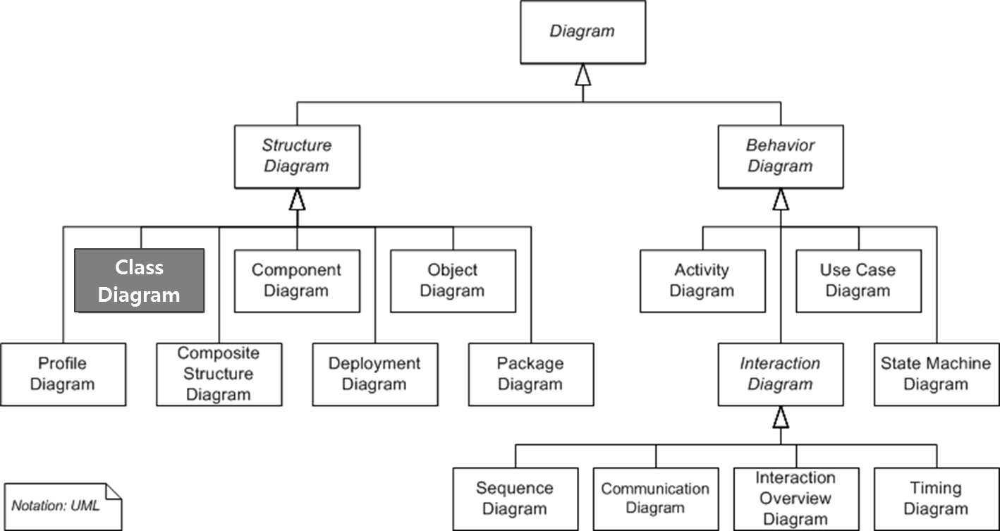

# Class Diagram

### 목차

1. UML
2. Class Diagram
3. **Class Diagram Element**
4. **클래스간의 관계**
5. 일반화 (Generalization)
6. 실체화 (Realization)
7. 의존 (Dependency)
8. **연관(Association, 방향성 있는 연관(Directed Association)**
9. **집합(Aggregation)**
10. **합성(Composition)**

 

## UML

- Unified Modeling Language, 통합 모델링 언어: 모델을 만드는 표준 언어

*Structure Diagram(구조 다이어그램) 7개, Behavior Diagram(행위 다이어그램) 7개*

- 구조 다이어그램: 시스템의 개념, 관계 등의 측면에서 요소들을 나타냄. 각 요소들의 정적인 면을 보기 위한 것
- 행위 다이어그램: 각 요소들 혹은 요소들 간의 변화나 흐름, 주고 받는 데이터 등의 동작을 보기 위한 것

 

## Class Diagram

- Structure Diagram

클래스 내부의 정적인 내용이나 클래스 사이의 관계를 표기하는 다이어그램으로 시스템의 일부 또는 전체의 구조를 나타낼 수 있다. 의존 관계를 명확히 보게 해주고, 순환 의존이 발생하는 지점을 찾아내서 어떻게 이 순환 고리를 깨는 것이 가장 좋은지 결정할 수 있게 해준다.

*목적 별 클래스 다이어그램*

클래스 다이어그램은 목적에 따라 다르게 사용: 개념, 명세, 구현

1. 개념
   문제 도메인의 구조를 나타냄. 사람이 풀고자 하는 문제 도메인 안에 있는 개념과 추상적 개념을 기술하기 위한 것
   소스코드와 관계가 깊지 않음. 자연어와 더 관련이 있다. 의미론적(언어의 뜻을 규정하는) 규칙에 얽매이지 않음. 의미하는 바가 모호해지거나 해석에 따라 달라질 수 있는 부분이 존재
2. 명세, 구현
   소프트웨어의 설계 혹은 완성된 소프트웨어의 구현 설명 목적 등으로 사용. 설계 후 소스코드로 바꾸거나 구현 된 소스코드를 설명하기 위해 사용하기 때문에 소스코드와 관계가 깊다.

 

## 클래스 다이어그램의 요소(Element)

### Class

보통 3개의 구획(Compartment)으로 나누어 클래스의 이름(Name: 필수), 속성(Attribute), 기능(Operation)을 표기

*클래스*

필드, 메서드의 Access modifier(접근 제한자), 필드명(메서드명), Data Type, Parameter(매개변수), Return Type 등을 나타낼 수 있다.

클래스의 세부사항들을 상세하게 적는 것이 유용할 때도 있지만, UML 다이어그램은 필드나 메서드를 모두 선언하는 곳이 아니기 때문에 다이어그램을 그리는 목적에 필요한 것만 사용하는 것이 좋다.

보통 3개의 구획(Compartment)을 사용하지만 미리 정의되거나 사용자 정의된 모델의 속성(비즈니스 룰, 책임, 처리 이벤트, 발생된 예외 등)을 나타내기 위한 추가 구획도 사용할 수 있다고 함.

| 구성요소         | 설명                                                         |
| ---------------- | ------------------------------------------------------------ |
| 클래스(Class)    | - 공통의 속성, 메서드, 관계, 의미를 공유하는 객체들의 집합   |
| 속성 (Attribute) | - 클래스의 구조적 특성에 이름을 붙인 것으로 특성에 해당하는 인스턴스가 보유할 수 있는 값의 범위를 기술. Class의 멤버 변수 |
| 메드 (Method)    | - 이름, 타입, 매개변수들과 연관된 행위를 호출하는데 요구되는 제약사항들을 명세하는 클래스의 행위적 특징 |

### Stereo Type

UML에서 제공하는 기본 요소 외에 추가적인 확장 요소를 나타내는 것. 쌍 꺾쇠와 비슷하게 생긴 길러멧(guillemet, « ») 사이에 적는다.

길러멧이라는 기호는 쌍 꺾쇠의 크기보다 작다. 종이나 화이트보드에 그릴 때는 상관없지만 공식적인 문서라면 이 기호를 구분해서 사용하는 것이 좋다.

*스테레오 타입: 인터페이스와 유틸리티 클래스를 표현하고 있는 다이어그램*

- Underline: 정적(Static)필드 혹은 메서드
- {readOnly}: final 키워드를 사용하는 상수

스테레오 타입으로 많이 사용 되는 것

- «interface»
- «utility»
- «enumeration» 
- «abstract»

#### Abstract Class/Method

- 1개 이상의 메서드가 구현체 없이 명세만 존재하는 클래스

*추상클래스*

추상 클래스의 이름과 메서드는 italic체나, {abstract} 프로퍼티를 사용하여 표기한다.

 

## 클래스 간의 관계

### Generalization (일반화)

- 부모(Super)클래스와 자식(Sub)클래스 간의 상속(Inheritance) 관계를 나타냄.
- 자식 클래스가 주체가 되어 자식 클래스를 부모 클래스로 일반화(Generalize) 하는 것을 말함.
  - 반대의 개념은 부모 클래스를 자식 클래스로 구체화(Specialize) 하는 것.
- 상속은 부모 클래스의 필드 및 메서드를 사용 및 구체화 하여 필드 및 메서드를 추가하거나 필요에 따라 메서드를 오버라이딩(Over Riding) 하여 재정의 함.
- 부모 클래스가 추상 클래스인 경우에는 인터페이스의 메서드 구현과 같이 추상 메서드를 반드시 오버라이딩 하여 구현 해야 함.

*Generalization*

- UML 표기: 클래스 사이에 실선을 연결, 부모 클래스 쪽에 비어있는 삼각형으로 나타냄
- Java: extends

### Realization (실체화)

- 인터페이스의 spec(명세, 정의)만 있는 메서드를 오버라이딩 하여 실제 기능으로 구현하는 것

*Realization*

#### 표기법

1. 인터페이스를 클래스 처럼 표기 후 «interface» 추가.
   인터페이스와 클래스를 점선으로 연결 후 인터페이스 쪽에 비어있는 삼각형
2. 인터페이스를 원으로 표기 후 인터페이스 이름 명시
   인터페이스와 클래스를 실선으로 연결

### Dependency (의존)

### Association (연관)

### Directed Association (직접 연관)

### Aggregation (집합, 집합연관)

### Composition (합성, 복합연관)

