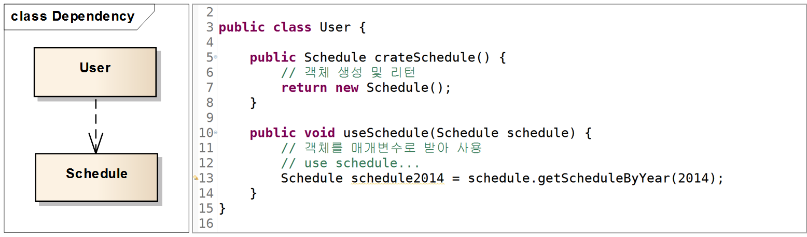

# Class Diagram

### 목차

1. UML
2. Class Diagram
3. **Class Diagram Element**
5. 일반화 (Generalization)
6. 실체화 (Realization)
7. 의존 (Dependency)
8. **연관(Association, 방향성 있는 연관(Directed Association)**
9. **집합(Aggregation)**
10. **합성(Composition)**

 

## UML

- Unified Modeling Language, 통합 모델링 언어: 모델을 만드는 표준 언어

*Structure Diagram(구조 다이어그램) 7개, Behavior Diagram(행위 다이어그램) 7개*

- 구조 다이어그램: 시스템의 개념, 관계 등의 측면에서 요소들을 나타냄. 각 요소들의 정적인 면을 보기 위한 것
- 행위 다이어그램: 각 요소들 혹은 요소들 간의 변화나 흐름, 주고 받는 데이터 등의 동작을 보기 위한 것

 

## Class Diagram

- Structure Diagram

클래스 내부의 정적인 내용이나 클래스 사이의 관계를 표기하는 다이어그램으로 시스템의 일부 또는 전체의 구조를 나타낼 수 있다. 의존 관계를 명확히 보게 해주고, 순환 의존이 발생하는 지점을 찾아내서 어떻게 이 순환 고리를 깨는 것이 가장 좋은지 결정할 수 있게 해준다.

*목적 별 클래스 다이어그램*

클래스 다이어그램은 목적에 따라 다르게 사용: 개념, 명세, 구현

1. 개념
   문제 도메인의 구조를 나타냄. 사람이 풀고자 하는 문제 도메인 안에 있는 개념과 추상적 개념을 기술하기 위한 것
   소스코드와 관계가 깊지 않음. 자연어와 더 관련이 있다. 의미론적(언어의 뜻을 규정하는) 규칙에 얽매이지 않음. 의미하는 바가 모호해지거나 해석에 따라 달라질 수 있는 부분이 존재
2. 명세, 구현
   소프트웨어의 설계 혹은 완성된 소프트웨어의 구현 설명 목적 등으로 사용. 설계 후 소스코드로 바꾸거나 구현 된 소스코드를 설명하기 위해 사용하기 때문에 소스코드와 관계가 깊다.

 

## 클래스 다이어그램의 요소(Element)

### Class

보통 3개의 구획(Compartment)으로 나누어 클래스의 이름(Name: 필수), 속성(Attribute), 기능(Operation)을 표기

*클래스*

필드, 메서드의

- 접근 제한자(Access Modifier)
- 필드명 혹은 메서드명
- Data Type
- 매개변수(Parameter)
- Return Type 

등을 나타낼 수 있다.

클래스의 세부사항들을 상세하게 적는 것이 유용할 때도 있지만, UML 다이어그램은 필드나 메서드를 모두 선언하는 곳이 아니기 때문에 다이어그램을 그리는 목적에 필요한 것만 사용하는 것이 좋다.

보통 3개의 구획(Compartment)을 사용하지만 미리 정의되거나 사용자 정의된 모델의 속성(비즈니스 룰, 책임, 처리 이벤트, 발생된 예외 등)을 나타내기 위한 추가 구획도 사용할 수 있다.

| 구성요소         | 설명                                                         |
| ---------------- | ------------------------------------------------------------ |
| 클래스(Class)    | 공통의 속성, 메서드, 관계, 의미를 공유하는 객체들의 집합     |
| 속성 (Attribute) | 클래스의 구조적 특성에 이름을 붙인 것으로 특성에 해당하는 인스턴스가 보유할 수 있는 값의 범위를 기술. Class의 멤버 변수 |
| 메서드 (Method)  | 이름, 타입, 매개변수들과 연관된 행위를 호출하는데 요구되는 제약사항들을 명세하는 클래스의 행위적 특징 |

### Stereo Type

UML에서 제공하는 기본 요소 외에 추가적인 확장 요소를 나타내는 것. 쌍 꺾쇠와 비슷하게 생긴 길러멧(guillemet, « ») 사이에 적는다.

길러멧이라는 기호는 쌍 꺾쇠의 크기보다 작다. 종이나 화이트보드에 그릴 때는 상관없지만 공식적인 문서라면 이 기호를 구분해서 사용하는 것이 좋다.

*스테레오 타입: 인터페이스와 유틸리티 클래스를 표현하고 있는 다이어그램*

- Underline: 정적(Static) 필드 혹은 메서드
- {readOnly}: final 키워드를 사용하는 상수

#### Abstract Class/Method

- 1개 이상의 메서드가 구현체 없이 명세만 존재하는 클래스

*추상클래스*

추상 클래스의 이름과 메서드는 italic체나, {abstract} 프로퍼티를 사용하여 표기한다.

 

## 클래스 간의 관계

### Generalization (일반화)

- 부모(Super)클래스와 자식(Sub)클래스 간의 상속(Inheritance) 관계를 나타냄.
- 자식 클래스가 주체가 되어 자식 클래스를 부모 클래스로 일반화(Generalize) 하는 것을 말함.
  - 반대의 개념은 부모 클래스를 자식 클래스로 구체화(Specialize) 하는 것.
- 상속은 부모 클래스의 필드 및 메서드를 사용 및 구체화 하여 필드 및 메서드를 추가하거나 필요에 따라 메서드를 오버라이딩(Over Riding) 하여 재정의 함.
- 부모 클래스가 추상 클래스인 경우에는 인터페이스의 메서드 구현과 같이 추상 메서드를 반드시 오버라이딩 하여 구현 해야 함.

*Generalization*

- UML 표기: 클래스 사이에 실선을 연결, 부모 클래스 쪽에 비어있는 삼각형으로 나타냄
- Java: extends

### Realization (실체화)

- 인터페이스의 spec(명세, 정의)만 있는 메서드를 오버라이딩 하여 실제 기능으로 구현하는 것

*Realization*

#### 표기법

1. 인터페이스를 클래스 처럼 표기 후 «interface» 추가.
   인터페이스와 클래스를 점선으로 연결 후 인터페이스 쪽에 비어있는 삼각형
2. 인터페이스를 원으로 표기 후 인터페이스 이름 명시
   인터페이스와 클래스를 실선으로 연결

### Dependency (의존)

- 클래스 다이어그램에서 일반적으로 제일 많이 사용되는 관계. 어떤 클래스가 다른 클래스를 참조하는 것을 말한다.

*Dependency: 자바에서 참조하는 형태에 대한 코드*

참조의 형태는 메서드 내에서 대상 클래스의 객체 생성, 객체 사용, 메서드 호출, 객체 리턴, 매개변수로 해당 객체를 받는 것 등

해당 객체의 참조를 계속 유지하지는 않는다.

*Dependency Stereo Type*

스테레오 타입으로 어떠한 목적의 Dependency인지 의미를 명확히 명시할 수 있다. Dependency의 목적 또는 형태가 중요할 경우 사용 할 수 있다.

### Association (연관), Directed Association (직접 연관)

- 클래스 다이어그램에서의 Assocation은 보통 다른 객체의 참조를 가지는 필드를 의미한다.

### Association과 Directed Association의 차이

*Association: 화살표가 의미하는 방향성(Navigability)인데 이 것에 따라 참조하는 쪽과 참조당하는 쪽을 구분*

- 첫번째 다이어그램 - Association: 실선 하나로 클래스를 연결하여 표기
  - Navigability가 없는 Association은 명시가 되지 않은 것으로 User가 Address를 참조할 수도, Address가 User를 참조할 수도, 또는 둘 다일 수도 있다는 것을 의미.
- 두번째 다이어그램 - Directed Association: 클래스를 실선으로 연결 후 실선 끝에 화살표를 추가
  - 두번째 다이어그램은 User에서 Address 쪽으로 화살표가 있으므로 User가 Address를 참조하는 것을 의미
  - 화살표 옆에 있는 `- addresses`는 역할명(Role Name)을 나타내고 Address가 User 클래스에서 참조될 때 어떤 역할을 가지고 있는지를 의미한다.
  - `*`은 개수(Mulitiplicity)를 나타내는데 대상 클래스의 가질 수 있는 인스턴스 개수 범위를 의미한다. `0...1` 과 같이 점으로 구분하여 앞에 값은 최소값, 뒤에 값은 최대 값을 의미하는데 `*`은 `0...`과 같은 의미로 객체가 없거나 수가 정해지지 않은 여러 개일 수도 있다는 것을 의미.
    - 이전에는 Mulitiplicity가 아닌 Cardinality로 불렸는데 "특정 집합 또는 다른 그룹에 있는 요소의 수" 라는 Cardinality의 사전적 의미가 실제 인스턴스의 수가 아닌 가질 수 있는 범위를 지정하는 클래스 다이어그램에서의 의미에 적합하지 않다는 이유로 바뀌었다.
- 세번째 다이어그램: 두번째 다이어그램과 비슷한 의미를 가지고 있다. 다른 형태인 속성 표기법으로 나타낸 것. roleName은 보통 클래스의 필드명이 된다. 속성 표기법이 두번째 클래스 다이어그램과 조금 다른 점은 여러 개의 객체에 대한 컨테이너(Container)가 `List`라는 것 까지 알려주고 있다.

#### 두번째와 세번째 다이어그램이 완전히 동일한 의미를 가지게 하려면 어떻게 해야 할까?

*Association Class*

연관클래스(Association Class)를 사용하여 어떤 종류의 컨테이너 클래스가 사용되는지까지 나타낼 수 있다.

하지만 자바에서 기본으로 제공하는 `List`를 그림과 같이 표기하는 건 조금 귀찮은 일일 수 있다. 그래서 오른쪽 그림과 같이 스테레오 타입으로 표기할 수도 있다. 이로써 속성 표기법으로 표현된 것과 모든 의미가 같아졌다.

보통은 클래스의 속성이 기본 제공 클래스가 아니거나 강조하고 싶을 때 Association 관계로 나타낸다.

Association Class는 조금 다른 의미로도 사용될 수 있는데, 예를 들어 학생과 수강과목 클래스가 Association 관계를 가지고 있는데 단순 Association 관계가 아니라 각 관계마다 해당 과목의 학점이라는 속성이 필요하다면 어떻게 나타낼 수 있을까? 이럴 경우에도 Association Class를 사용하여 나타낼 수 있다.

*Association Class*

물론 grade라는 값을 Subject 클래스 자체의 속성으로 할 수도 있지만 Subject의 속성이라기 보다는 Student와 Subject 사이의 관계에 대한 속성이라는 관점에서 위의 다이어그램처럼 Association Class로 나타낼 수 있다.

 

### Aggregation (집합, 집합연관)

Shared Aggregation 이라고도 함. 합성연관(Composite Aggregation)과 함께 Association 관계를 조금 더 특수하게 나타낸 것으로 전체(whole)와 부분(part)의 관계를 나타낸다.

Association은 집합이라는 의미를 내포하고 있지 않지만 Aggregation은 집합이라는 의미를 가지고 있다.

*Aggregation*

UML표기법: whole과 part를 실선으로 연결 후 Whole 쪽에 비어있는 다이어몬드 표기. Part 쪽에는 화살표를 명시해도 되고 명시하지 않아도 된다.

Aggregation의 다이아몬드가 이미 Navigability의 방향을 표현하고 있다.

Association과 Aggregation은 집합이라는 개념적인 차이는 있지만 코드에서는 이 차이를 구분하기 힘들다.

 

### Composition (합성, 복합연관)

Aggregation과 비슷하게 전체(Whole)와 부분(Part)의 집합 관계를 나타내지만 개념적으로 Aggregation보다 더 강한 집합을 의미한다.

*Composition*

Aggregation과 비슷하지만 다이아몬드의 내부가 채워져 있다는 점만 다르다.

Composition의 강한 집합이란 Part가 Whole에 종속적이어서 Part가 Whole의 소유이다.

반면 Aggregation은 Part가 Whole에 대해 독립적이어서 Whole이 Part를 빌려 쓰는 것과 비슷하다. 이러한 의미 때문에 Aggregation과는 다르게 명확하게 나타나는 점이 있습니다.

1. Part를 가지는 Whole 인스턴스가 Part 인스턴스의 전체 수명을 책임진다.
2. Part에 해당하는 인스턴스는 공유 될 수 없다.

1번의 Whole 인스턴스가 Part 인스턴스의 전체 수명을 책임진다는 의미는 다음과 같다.

- Whole 인스턴스가 Part 인스턴스 생성
- Whole 인스턴스가 소멸되면 Part 인스턴스도 함께 소멸
- Whole 인스턴스가 복사되면 Part 인스턴스도 함께 복사

2번의 Part에 해당하는 인스턴스는 공유 될 수 없다는 의미는

*Shallow Copy*

userA가 참조하고 있는 user 객체를 clonedUser 객체를 만들고 참조변수 userB에서 참조하고 있다. User 객체는 제대로 복사가 됐지만 user 객체 안에서 참조하고 있는 address는 clonedUser 객체도 똑같이 참조하고 있다. 이것을 얕은 복사(Shallow Copy)라고 한다.

얕은 복사의 경우 Part에 해당하는 address 객체가 공유된다.

*Deep Copy Object Diagram*

user 객체가 복사되어 clonedUser 객체가 생성될 때 user 객체가 참조하여 가지고 있는 address 객체 또한 같이 복사되어 clonedUser 객체는 새로운 clonedAddress 객체를 참조하여 가지고 있다.

*Deep Copy Code*

Aggregation 관계와 Composition 관계를 UML 툴에서 그린 후 Code Generation을 하면 똑같은 코드가 생성된다. 하지만 Composition에서는 개발자가 구현해야할 부분이 몇가지 있다.

위에서 본 Part에 해당하는 인스턴스가 공유되지 않게 하기 위한 Deep Copy 구현과 Part를 가지는 Whole 인스턴스가 Part 인스턴스의 수명 전체를 책임져야 한다는 것에 따라 Whole 클래스의 생성자 또는 기타 메서드 내에서 Part 인스턴스를 생성해야 하고 외부에서 Part 객체를 생성하지 못하도록 Whole 클래스에는 Part 인스턴스에 대한 Setter가 있으면 안된다. 다른 언어에서는 생명주기와 관련된 다른 추가적인 것도 있겠지만 자바에서의 객체 소멸은 GC가 수행하므로 Part 인스턴스의 소멸은 신경쓰지 않아도 된다.